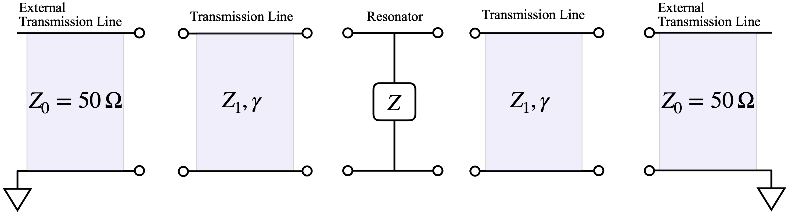

# q-factor-fit

This code fits the Q-factor of the KTO resonator based on the following two-port circuit. 

This circuit is composed of two identical segements of transmission line, each characterized by the impedance $Z_1$ and propagation constant $\gamma = a+bj$, a central impedance element $Z$, and input and output impedances $Z_0$.

Each transmission line segment with impedance $Z_1$ and propagation constant $\gamma$ has the ABCD parameter matrix:
$$\begin{pmatrix}
\cosh(\gamma) & Z_1 \sinh(\gamma)\\
\frac{1}{Z_1} \sinh(\gamma) & \cosh(\gamma)
\end{pmatrix}$$

The middle impedance component has the ABCD parameter matrix:
$$\begin{pmatrix}
1&0\\ \frac{1}{Z} & 1
\end{pmatrix}$$

The total ABCD parameter matrix is obtained by multiply the ABCD parameters together. Then, the scattering parameter $S_{21}$ is obtained from the total ABCD parameter matrix:
$$S_{21} = \frac{2}{A +\frac{B}{Z_0}+C+DZ_0}=\frac{2ZZ_0Z_1}{\left(Z_0 \cosh(\gamma) + Z_1 \sinh(\gamma)\right) \left((2 Z + Z_0) Z_1\cosh(\gamma) + (2 Z Z_0 + Z1^2) \sinh(\gamma)\right)}$$

Near the resonant frequency $\omega_0$, the impedance $Z$ is approximated as $Z\approx R+2\Delta \omega L j$. Thus, the effective resistance and inductance can be read from the $S_{21}$ curve. Finally, the internal Q-factor $Q_0 = \frac{\omega L}{R}$ is obtained.  

